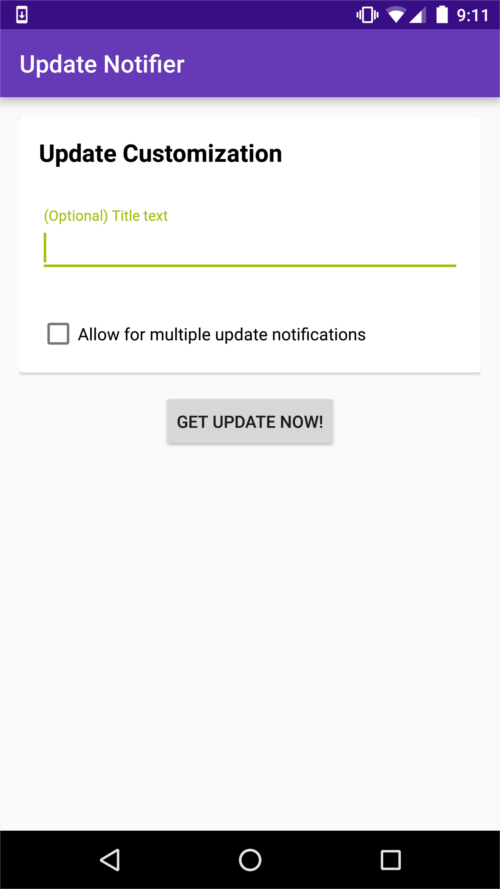
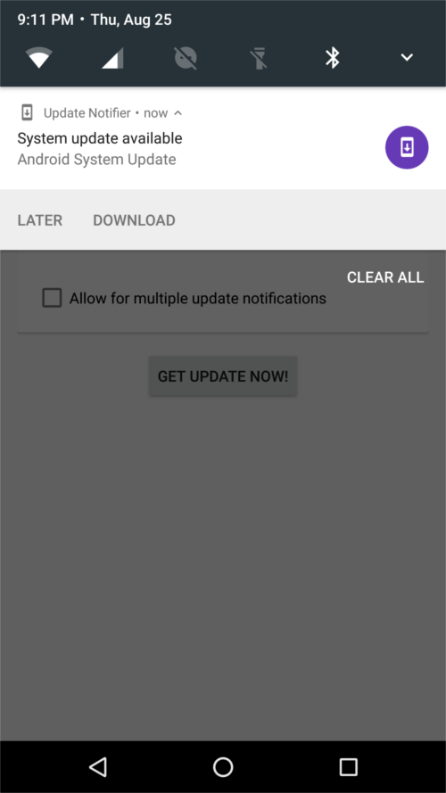
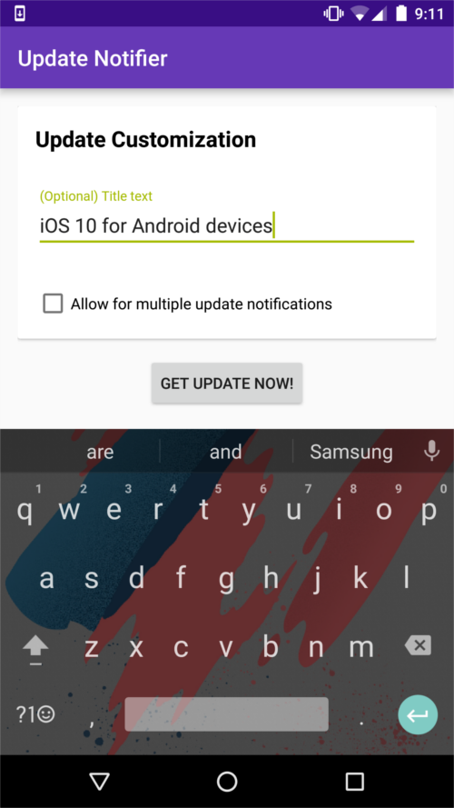
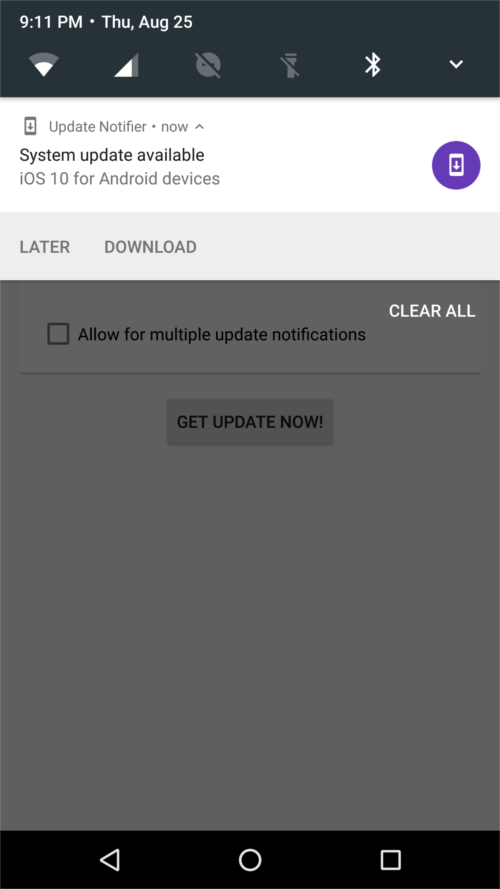
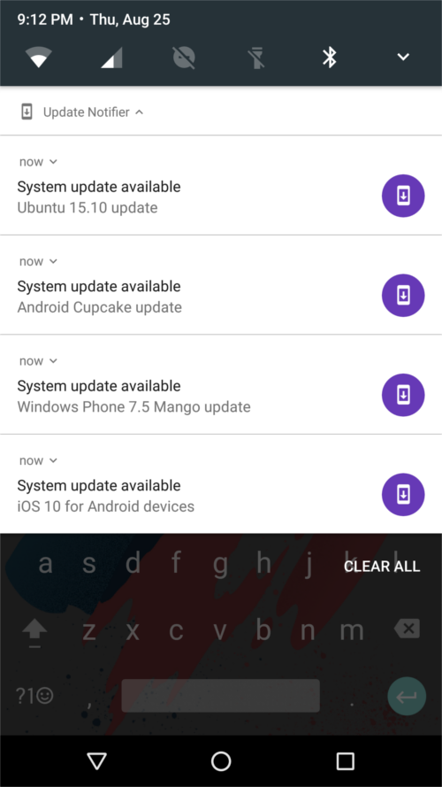

## Fake Update Notifier

☐ Under Development ☐ Alpha ☐ Beta ☐ RC ☑ Released

Program is complete and/or released to Play Store.

_____________________

Make it look like your phone is ready to update! Android updates come once every 100 years or so if you don't have a Nexus phone, so why not experience the magic on your phone that will never get past KitKat? 

Impress your friends by showing off your phone that was EOLed 5 months after release by showing them you have an update. Then go back to basking in sadness that you didn't get an iPhone or a Nexus device. I'm sure you love you Galaxy Grand Prime Duos Epic 4G.

Screenshots: 

